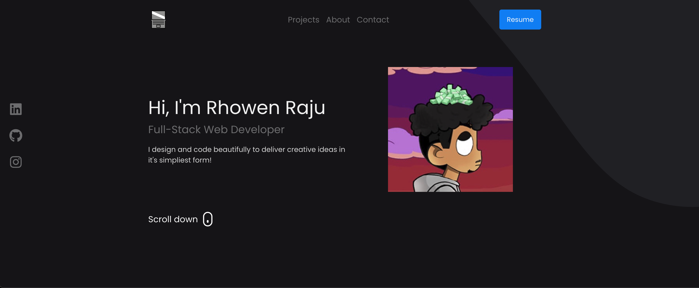

# React Portfolio!
Live Preview - [Click Here](https://rraju002.github.io/portfolio-react/)

 

  

 
 

## Description
This project was created to display an online portfolio using React!

## Table of Contents
  * [Installation](#installation)
  * [Contribution](#contribution)
  * [Testing](#testing)
  * [Questions](#questions)
  * [License](#license)
    
    
## Installation
    
  _Follow these steps to properly install this application:_
  Run "npm I" and "npm start" to view the app in http://localhost:3000 to view in browser
      
## Contribution
  _If you would like to contribute, please adhere to these guidelines:_
  Fork repo and contribute away!
      
## Testing
  _Instructions for testing application:_
  n/a
      
## Questions
      
  _For further questions:_
  Feel free to email me rraju002@ucr.edu!
  
  _Contact Info:_
  GitHub: [undefined](https://github.com/undefined)
  Email: [rraju002@ucr.edu](mailto:rraju002@ucr.edu)
    
## License
      
  _This application has the undefined._
      
  For more information please view the [license description]().
  
  